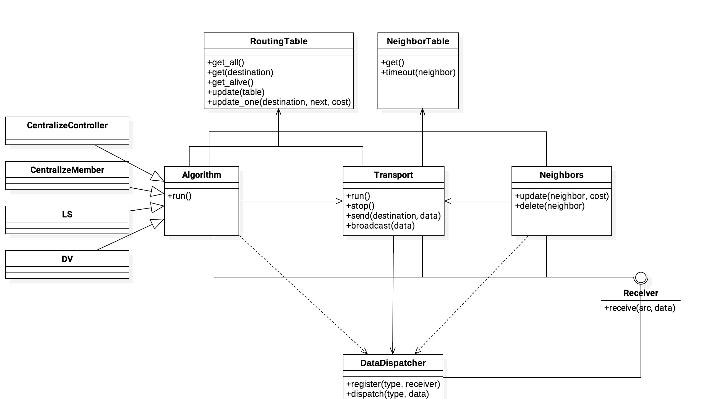

# routing-simulation

computer networking final project



## Usage

### Dependency

- python \>= 3.5
- pip3

### Installing Packaages

```
$ pip install -r requirements.txt
```

### Run

<!-- TODO -->
