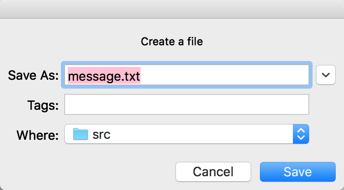

# 路由系统模拟

> 2015级计算机网络期末项目

## 简介

在应用层模拟一个可以在运行时动态添加、减少节点的路由系统。

### 小组成员

- 15331344 薛明淇
- 15331348 颜泽鑫
- 15331371 姚志立
- 15331373 叶佳全

### 运行环境与依赖

见[github仓库](https://github.com/VinaLx/routing-simulation)

## 具体需求

分别使用

- 类[Distance Vector Routing Protocol](https://en.wikipedia.org/wiki/Distance-vector_routing_protocol)(DV)
- 类[Link State Routing Protocol](https://en.wikipedia.org/wiki/Link-state_routing_protocol)(LS)
- 有中控系统的类LS协议

实现路由系统，这个系统`S`需要满足要求`R`，`R`的描述大致如下：

1. `S`可抽象为一个带权的无向图，其中"主机"为"**节点**"，"主机之间的逻辑链路"为"**边**"，"主机之间的消息传递代价"为"**边权**"
2. `S`中的任意一个节点可以选择另一个相对其可达的目标节点发送消息`M`，目标节点可以完整接受`M`
3. 在`S`稳定时，`S`为节点之间的消息传递选择的路径的**边权**总和需要时所有可能的路径中最小的（之一）
4. 在`S`运行时，可以向系统中添加**节点**，并添加与新**节点**相关的**边**，产生一个新系统`S'`，`S'`满足要求`R`
5. 在`S`运行时，可以从系统中删除**节点**，并删除所有与之相关的**边**，产生一个新系统`S'`，`S'`满足要求`R`

## 实现

### 整体结构

在此路由系统中，单个主机的整体模块结构大体上如图所示：


`RoutingTable`是全局单例的路由表，逻辑上内容是目标主机到下一跳主机的映射。因此可以通过`RoutingTable.get`以及其它方法来查询路由表内部封装的信息。

`Transport`负责封装底层的数据传输，`Transport.send`将各模块的结构化数据包装为数据包并且序列化，查询`RoutingTable`确定下一跳主机进行发送。而目标（下一跳）节点的`Transport`收到消息并进行反序列化后，将接收到的`data`和`type`共同交给`DataDispatcher`进行处理。`Transport`之外的模块不需要关心在进行底层数据传输时使用的报文格式和数据，可以只关心自身要传输的数据。

`DataDispatcher`负责分派`Transport`接收到的数据给各个模块，各个模块在初始化阶段向`DataDispatcher.register`注册回调，在`DataDispatcher`收到数据后，根据`type`查找登记过的`receiver`，将`data`进行分发。这样在`Transport`之外，根据各个模块的需要可以定义非提前约定的报文结构。

不同的`Algorithm`负责实现不同的路由协议的算法部分，例如`DV`协议，`Algorithm`会定期通过`Transport`向其它主机发送自身的路由信息，并且在通过`DataDispatcher`接收到邻居的路由信息后，对`RoutingTable`进行更新。其它算法类似，通过算法自身内部的逻辑，对路由表进行更新。除了`Algorithm`之外的模块不需要关心`Algorithm`使用的具体算法和协议也可以进行正常工作。

`NeighborTable`保存邻居的状态，逻辑上为邻居主机到代价的映射，在邻居内容更新时，`NeighborTable`会通知自己的观察者（这里唯一的观察者是算法，所有的算法都需要在邻居状态变化时对应地更新路由表）。

`Neighbors`负责管理当前主机的邻居状态，以及实现了主动添加、更新、删除邻居的协议逻辑，大致是在`Neighbors.update`以及`Neighbor.delete`调用后，通过与邻居的握手来完成邻居状态的变化。对于宕机主机的发现，由`Algorithm`通过逻辑实现，后详。

### Hostname Server (HNS)

`HNS`没有在单个主机的结构中标出，因为`HNS`是独立的一个主机。

#### Motivation

由于在程序的绝大部分我们关心的只是系统中主机和主机的逻辑关系，主机只需要有自己的逻辑标识即可，所以我们希望把主机的标识（主机名）和主机的网络地址分离开，只在传输数据的过程中，需要获取到主机名对应的网络地址，其他时候均可以完全使用主机名来操作。

#### 程序流程

`HNS`相对于主机而言，在逻辑上是永久存在的。在主机启动时，需要指定当前主机使用的`HNS`的地址，`Transport`会在启动时向`HNS`登记自身的主机和网络地址，之后加入系统的主机就可以在`HNS`上获知当前主机的存在。在`Transport`传输数据时，接收的`destination`为主机名，因此它需要先向`HNS`查询该主机名对应的网络地址来进行数据的传输，如果无法查询到主机的地址，那么无法进行数据的发送。

除了`Transport`以外，程序的其它模块完全不需要知道`HNS`的存在。

#### 具体实现

by @姚志立

##### 数据结构

在`HNS`和`Transport`中使用的映射表`mapping_table`的数据结构为：

```
{
  name: (ip, port)
}
```
其中，`name`为主机的名字，特别的，`HNS`的主机名字固定为`'hns'`；`ip`和`port`为对应主机监听的地址。

##### 逻辑实现
```

1. 监听。初始化时，HNS获取自身监听的地址并开始监听，mapping_table只有hns的条目
2. 接收。收到数据时，新建线程处理数据，新建线程跳到步骤3，监听线程返回步骤1继续监听
3. 更新。将数据解析为发送方的注册信息，即发送方的初始名字和监听地址,根据注册信息更新自身的mapping_table
4. 响应。将最新的mapping_table封装成Transport模块定义的报文发给所有已知的主机，以Transport模块的TYPE作为type字段

```

### Transport具体实现

by @姚志立

`Transport`实现了封装数据、解封数据、收发数据等功能。

#### 数据包的协议格式

数据包协议分3层，类似于实际计算机网络中的链路层、网络层和运输层

1. 类链路层帧

```
{
  'next_name': 直接接收方，类似于mac地址，发送方根据routing_table模块，输入目的地得到，
               发送时只管到达该接收方，不管其是否为目的地
  'last_name': 上一个发送方，对于发送方，这个字段总是自己的主机名
  'broadcasting': 是否为广播报文
  'visited': 已通过的主机，用于广播
  'datagram': 下一层的类网络层数据报
}
```
该层报文主要用于正确发送到下一个主机，以及广播的实现

2. 类网络层数据报

```
{
  'src': 源发送方
  'dest': 最终目的地
  'passed_by': 经过的主机
  'data': 下一层的原数据
}
```
该层报文主要用于识别是否达到目的地，若是则进一步拆包得到data，若否，则将该数据报原封不动转发出去

3. 原数据层

```
{
  'type': 数据的类型，主要用于Dispatcher模块分发数据
  'data': 原始数据，根据每个模块发送的数据而定，eg: HNS发送的数据该字段为mapping_table
}
```
该层报文用于分发数据到对应模块，进一步进行处理，这已经不是Transport模块的作用范围。

#### 接收数据

接收数据的功能逻辑实现：
```

1. 监听。监听端口，当收到数据，交给下一步处理。
2. 处理。
* 首先，查看帧的广播字段，若为广播报文，则进行二次广播
* 然后，查看数据报的目的地字段，若目的地为自身，则进一步拆包，把type和原数据交给Dispatcher分发，否则，将数据报进行转发

```

#### 发送数据

发送数据分为3种类型：普通发送，转发，广播

##### 普通发送

普通发送数据的逻辑为：

```

1. 封装数据报。将原数据包装成数据报，源主机为自身，经过的主机只有自身
2. 成帧。将数据报包装成帧，下一跳主机名通过调用routing_table模块的get函数获得，
   上一跳主机为自身
3. 发送。查询mapping_table，得到对应下一跳主机的物理地址，通过socket，
   用udp方式将包装好的帧发送给下一跳主机

```

##### 路由转发

路由转发的逻辑为：

```

1. 更新数据报的passed_by字段，加入自身
2. 成帧。将数据报包装成帧，下一跳主机名通过调用routing_table模块的get函数获得，
   上一跳主机为自身
3. 发送。查询mapping_table，得到对应下一跳主机的物理地址，通过socket，
   用udp方式将包装好的帧发送给下一跳主机

```

##### 广播

广播的逻辑为：

```
广播分为初次广播和二次广播，二次广播类似于转发，二次广播的参数增加src字段表示源主机

1. 获取所有邻居。此处用到neighbors模块的函数get
2. 对每个不在visited里的邻居n：
  a. 封装数据报，其中，源 = 初次广播 ? 自身 : 二次广播传入的参数src，目的地为n。
  b. 成帧。将数据报包装成帧，下一跳主机名通过调用routing_table模块的get函数获得，
     上一跳主机为自身，visited列表增加自身
  c. 发送。查询mapping_table，得到对应下一跳主机的物理地址，通过socket，
     用udp方式将包装好的帧发送给下一跳主机

```

#### Transport模块的receive函数

对于Transport模块，当收到的数据为HNS发来的数据时会调用receive函数，其逻辑仅为用HNS发来的mapping_table更新自身的mapping_table

#### Transport模块提供的接口

``` python
# 发送数据data到destination
send(destination, data)
# 将数据data广播出去
broadcasting(data)
# 处理数据类型为Transport的接口
receive(src, data)
```

### Algorithm具体实现

by @叶佳全

<!-- DV, LS, 中心化LS, 超时检测 -->

无论哪种路由选择算法，大体流程如下

1. 定期向邻居或全局发送状态信息。通过新开一个线程，在新开的线程中周期发送路由选择算法对应所需的状态信息，以避免阻塞主线程。
2. 接收其他路由发送的包，维护存活表以用来检测超时，更新路由表。若所选算法不为`DV`则还需要同时维护系统全局抽象出的带权无向图。
3. **超时检测**，`LS`和`DV`算法中，所有主机共同维护同一张存活表，并且每台主机同时有独立的存活表。由于数据包的发送过程会有传输时延，发送数据包的顺序与接收到的顺序不一定相同，如果没有独立的存活表，可能会出现旧的记录覆盖当前记录，导致误判超时，因此独立存活表是有必需的。而中心化`LS`只需中控维护一张存活表即可。具体如何使用存活表来进行超时检测，在不同的算法模块中单独讨论。

#### 数据结构

```python
# 链路状态图，储存系统全局抽象出的带权无向图
link_state = {
    hostname: {
        neighbor: cost,
    }
}

# 路由表，存储执行路由选择算法后的结果
routing_table = {
    destination: {
        next: hostname,
        cost: integer
    }
}

# 存活表，记录系统中主机上次活跃时间
alive_table = {
    hostname: last_time
}
```

#### DV

##### 发送

定期向所有邻居发送路由表，以及存活表。

发送前，依次进行如下次操作：

1. 更新存活表，将自己对应的字段更新为当前时间。
2. **超时检测**，扫描存活表，用当前时间减去每个`Host`上次活跃时间，将所有差值大于阈值`timeout`的`Host`记录在数组`dead_hostnames`中，并通知`Neighbors`以更新邻居状态。
3. 若当前路由表中存在超时主机对应表项，则根据邻居表重置路由表，即使得路由表中仅有自己和邻居，且下一跳为目标主机。
4. 根据邻居表，向所有邻居发送路由表及存活表。

```python
alive_table[self] = current_time
dead_hostnames = get_dead_hosts(alive_table, timeout)

if dead_hostnames is not empty:
    notify_neighbor_to_update(dead_hostnames)
    reset_routing_table()

data = {
    'routing': routing_table,
    'alive': alive_table
}

for hostname in neighbor_table:
    send(hostname, data)
```

##### 接收

接收邻居发送的数据包`data`，依次进行如下操作：

1. 扫描邻居发来的路由表`data['routing']`以及存活表`data['alive']`，若存活表`data['alive']`中有超时的主机，且该主机在`data['routing']`中有对应的表项，则丢弃该数据包，否则继续进行下面操作。
2. 更新自身存活表。比较自身存活表以及邻居发来的存活表，每个主机的记录取两者中对应字段中较新的值。
3. 覆盖记录邻居的路由表，并获取所有目标主机名。
4. 运行`DV`算法的核心部分，对每一个目标主机，依据$D_{self}(dest) = min_{next}(cost(self, next) + D_{next}(dest))$，在邻居路由表和自己的邻居表中，查找最短费用以及下一跳来更新路由表。并通知`RoutingTable`模块更新路由表。

```python
# 接收到的数据为 data，来源主机为 source

if have_timeout(data):
    return

alive_table = update_alive_table(data['alive'])

neighbor_routing_table[source] = data['routing']
destinations = get_all_hostnames()

for dest in destinations:
    # find the next_hop through which the cost from self to dest is minimum
    # D_{self}(dest) = min_{next}(cost(self, next) + D_{next}(dest))

    min_next, min_cost = None, -1

    for neighbor in neighbor_routing_table:
        if dest in neighbor_routing_table[neighbor]:
            indirect_cost = neighbor_routing_table[self][neighbor]['cost'] + \
                            neighbor_routing_table[neighbor][dest]['cost']

            if min_next is None or indirect_cost < min_cost:
                min_cost = indirect_cost
                min_next = neighbor if neighbor != self else dest

    self._routing_table[dest] = {
        'next': min_next,
        'cost': min_cost
    }
```

#### LS

##### 发送

定期向整个系统广播邻居表与存活表。

```python
data = {
    'neighbor': neighbor_table,
    'alive': alive_table
}

broadcast(data)
```

##### 接收

接收邻居发送的数据包`data`，依次进行如下操作：

1. 更新存活表，将自身对应的字段更新为当前时间。
2. 对于`data['alive']`中的每一项，若自身存活表中没有对应项，则添加进存活表；若自身存活表中有对应项，则更新为两者中较新的值。
3. 扫描存活表，用当前时间减去每个`Host`上次活跃时间，将所有差值大于阈值`timeout`的`Host`记录在数组`dead_hostnames`中，并通知`Neighbors`以更新邻居状态。
4. 根据`data['neighbor']`更新链路状态图中与来源主机`source`相关的边。
5. 对更新后的链路状态图进行过滤，将与超时主机相关的边删除。
6. 运行`Dijkstra`算法，获取该主机为起点的单源最短路径，并更新路由表。

```python
alive_table[self] = current_time

for hostname in data['alive']:
    if hostname not in alive_table:
        alive_table[hostname] = data['alive'][hostname]
    else:
        alive_table[hostname] = max(alive_table[hostname], data['alive'][hostname])

dead_hostnames = get_dead_hosts(alive_table, timeout)
notify_neighbor_to_update(dead_hostnames)

link_state[source] = data['neighbor']
link_state = remove_edges_relative_with_dead(link_state, dead_hostnames)

# Dijkstra
visited = [self]
prev_table = {}
for hostname in link_state:
    prev_table[hostname] = {
        'prev': None,
        'cost': -1
    }

while True:
    next_hostname = nearest_hostname_not_in_visited()

    if next_hostname is None:
        break

    add next_hostname to visited
    for hostname in link_state[next_hostname]:
        cost = prev_table[next_hostname]['cost'] + link_state[next_hostname][hostname]

        if prev_table[hostname]['cost'] > cost:
            prev_table[hostname] = {
                'prev': next_hostname,
                'cost': cost
            }

# update routing table
for destination in prev_table:
    last_hop = destination

    if prev_table[last_hop]['prev'] is None:
        continue

    while prev_table[last_hop]['prev'] != self:
        last_hop = prev_table[last_hop]['prev']

    routing_table[destination] = {
        'next': last_hop,
        'cost': prev_table[destination]['cost']
    }
```

##### 超时检测

除了在接收其他主机发送的数据包时检测以外，另外开启一个独立线程每隔固定时间`timeout`扫描存活表，将超时的主机统计出来，通知`Neighbors`以更新邻居状态，并更新路由表。

#### 中心化LS

##### 主控

定期向所有成员主机发送全局链路状态图，以及检测出的超时主机名列表。

```python
dead_hostnames = get_dead_hosts(alive_table, timeout)

data = {
    'link': link_state,
    'dead': dead_hostnames
}

for all hostname:
    send(hostname, data)
```

接收成员发送的数据包邻居表，依次进行如下操作：

1. 更新存活表，将来源主机对应的字段更新为当前时间。
2. 扫描存活表，用当前时间减去每个`Host`上次活跃时间，将所有差值大于阈值`timeout`的`Host`记录在数组`dead_hostnames`中，并通知`Neighbors`以更新邻居状态。
3. 根据收到的邻居表，更新链路状态图。
4. 对当前链路状态图进行过滤，将与超时主机相关的边删除。

##### 普通成员主机

定期向主控发送邻居表。

```python
data = {
    'neighbor': neighbor_table
}

send(controller, data)
```

接收主控发送的数据包，依次进行如下操作：

1. 用新的链路拓扑图`data['link']`直接覆盖掉旧的。
2. 检查`data['dead']`中是否有自己的邻居，若有则通知`Neighbors`以更新邻居状态。
3. 运行`Dijkstra`算法，获取该主机为起点的单源最短路径，并更新路由表。

```python
link_state = data['link']

# Dijkstra
visited = [self]
prev_table = {}
for hostname in link_state:
    prev_table[hostname] = {
        'prev': None,
        'cost': -1
    }

while True:
    next_hostname = nearest_hostname_not_in_visited()

    if next_hostname is None:
        break

    add next_hostname to visited
    for hostname in link_state[next_hostname]:
        cost = prev_table[next_hostname]['cost'] + link_state[next_hostname][hostname]

        if prev_table[hostname]['cost'] > cost:
            prev_table[hostname] = {
                'prev': next_hostname,
                'cost': cost
            }

# update routing table
for destination in prev_table:
    last_hop = destination

    if prev_table[last_hop]['prev'] is None:
        continue

    while prev_table[last_hop]['prev'] != self:
        last_hop = prev_table[last_hop]['prev']

    routing_table[destination] = {
        'next': last_hop,
        'cost': prev_table[destination]['cost']
    }
```

### Neighbors具体实现

by @薛明淇

Neighbors实现了更新（添加和改变）和删除邻居状态的逻辑。由于系统是一个无向图，因此两个节点之间的代价应该是相等的，所以`Neighbors`需要在可以容忍的错误范围内尽量保证节点之间邻居状态的一致性。这里采取与邻居进行两次握手来确定邻居关系。

#### 协议流程

假设`HostA`希望更新`HostB`的邻居状态，具体流程如下：

```
HostA ===[Cost]==> HostB

HostA将HostB加入等待集合中，启动timeout倒计时

HostB在自身邻居表中更新HostA的代价为`Cost`

1. HostA在timeout之前收到了HostB的回复

    HostA <==[Cost]=== HostB

    HostA在自身邻居表中更新HostB的代价为`Cost`

    HostA在等待集合中删除HostB

2. HostA在timeout之前没有收到HostB的回复

    HostA在等待集合中删除HostB
```

#### 其它

1. 主动删除邻居使用的流程与更新邻居一样，只不过这里实现上将`Cost`置为-1，并在接收时进行特殊判断。

2. 主动发起邻居状态变化的报文和回复邻居状态变化的报文在结构上是一样的，也就是说如果`HostA`在timeout过后收到了`HostB`的回复，`HostA`会认为这是个主动发起邻居状态变化的请求，并执行回复请求的逻辑，最终两台主机的邻居状态仍然一致。

3. 这里没有过多考虑安全性和错误处理的问题，因此传输数据的格式是十分简化的，并且协议上也仅仅用了两次握手而不是三次。

### 顶层模块 `Router`

顶层模块`Router`没有有在整体结构中展现出来。

`Router`做的事十分简单，通过接受当前主机的配置，来初始化下层的模块，并且根据下层所有模块所提供的接口，来向`Controller`和`View`提供对应的数据访问接口。

其中配置包含的项目有：

1. 自身的主机名 `hostname`
2. 自身的监听地址 `self_addr`
3. 使用的`HNS`的地址 `hns_addr`
4. 提供给`Algorithm`的主机超时时间 `dead_timeout`
5. 提供给`Algorithm`的路由表更新/信息发送间隔 `update_interval`
6. 如果使用的是中心化算法，中控系统的主机名 `controller_hostname`

提供的接口有：

``` python
# 启动路由器的运行
def run():

# 终止路由器的运行
def stop():

# 向`destination`发送普通的数据信息`message`
def send(destination: str, message: str):

# 获取当前主机认为的当前系统中存在的所有主机名
def get_alive() -> List[str]:

# 更新/添加邻居的状态
def update_neighbor(name: str, cost: int):

# 删除邻居
def remove_neighbor(name: str, cost: int):

# 获取当前路由表
# type Info = {next: str, cost: int}
def get_routing_table() -> Dict[str, Info]:
```

### UI

#### Router 配置界面
在运行Router之前需要对router进行配置。


选择配置文件。


配置文件格式为Json，格式如下所示。

```
{
  "hostname": "主机名",
  "ip": "IP地址",
  "port": 端口号,
  "hns_ip": "HNS IP地址",
  "hns_port": HNS 端口号,
  "algorithm": "使用的算法，具体有以下四个选择",
  # DV 距离矩阵算法
  # LS 链路状态算法
  # LS_CENTRALIZE 中心化的链路状态算法
  # LS_CONTROL 有中控的链路状态算法
  "dead_timeout": 180, # router在不进行操作之后自动dead
  "update_interval": 30, # 发送更新数据包的时间间隔
  "controller_hostname": "", # 控制主机名
  "neighbors": [
  ] # 启动路由器时所写入的静态邻居表
}
```

#### Router 主界面


界面的上半部分用于发送数据包。可以选择能够发送的对象（即该路由器的邻居），第二个文本框则是用于输入发送的文本数据。点击Send便可以发送数据，再发送完后，Data文本框会自动清空。Clear也可以清空输入的文本框。
界面的下半部分则是用于接受数据。Message是用于显示目前接受的到数据包内容，Log则是用于Debug的信息，包括接收的广播包内容，发送的数据包内容等。


在程序上方还有一个菜单栏。


第一个菜单选项是与文件相关功能。提供了可以保存Message和Log记录到本地的功能。





第二个菜单选项则是与动态修改邻居有关的功能。我们提供了可以动态增加、删除邻居和修改到邻居开销的功能。在进行相应操作之后会关闭窗口，需要在Log信息框中查看是否修改成功。


第三个菜单选项则是提供了显示路由器路由表和邻居表的功能。


## 程序运行测试

### 场景

测试完整拓扑图：


1. 系统起始状态

    拓扑中仅有A与B两台主机，它们之间的代价为5。从A发送消息给B可以成功发送。

2. 加入C，指定A与B为邻居，代价分别为1与3

    等待系统稳定。查看A路由表，应当看到A到B下一条主机为C，从A发送数据给B，路径应当为 A -> C -> B

3. 加入D，指定B与C为邻居，代价均为1

    等待系统稳定。查看A路由表，应当看到A到B下一跳主机为C，从A发送数据给B，路径应当为 A -> C -> D -> B

4. 删除节点D

    等待系统稳定。从A发送数据给B，情况应当与步骤2相同

5. 删除节点C

    等待系统稳定。从A发送数据给B，情况应当与步骤1相同

### 测试流程

1. 运行HostnameServer(HNS)主机
2. 准备好A、B、C、D主机的配置文件，配置文件格式如UI节所描述
3. 按照测试场景逐步向系统中添加、从系统中删除主机，过程中观察路由表、各模块输出日志、消息发送情况符合预期

### 运行测试

主机A、B、C、D的配置文件如下所示：

_注：任何协议下配置文件内容类似，除了`algorithm`字段和`controller_hostname`字段不同之外_

A:

```json
{
  "hostname": "A",
  "ip": "127.0.0.1",
  "port": 8889,
  "hns_ip": "127.0.0.1",
  "hns_port": 8888,
  "algorithm": "DV",
  "dead_timeout": 10,
  "update_interval": 3,
  "controller_hostname": "Control",
  "neighbors": []
}
```
B:

```json
{
  "hostname": "B",
  "ip": "127.0.0.1",
  "port": 8890,
  "hns_ip": "127.0.0.1",
  "hns_port": 8888,
  "algorithm": "..",
  "dead_timeout": 10,
  "update_interval": 3,
  "controller_hostname": "Control",
  "neighbors": [
    {
      "hostname": "A",
      "cost": 5
    }
  ]
}
```
C:

```json
{
    "hostname": "C",
    "ip": "127.0.0.1",
    "port": 8891,
    "hns_ip": "127.0.0.1",
    "hns_port": 8888,
    "algorithm": "..",
    "dead_timeout": 10,
    "update_interval": 3,
    "controller_hostname": "Control",
    "neighbors": [
        {
            "hostname": "B",
            "cost": 3
        },
        {
            "hostname": "A",
            "cost": 1
        }
    ]
}
```
D:

```json
{
    "hostname": "D",
    "ip": "127.0.0.1",
    "port": 8892,
    "hns_ip": "127.0.0.1",
    "hns_port": 8888,
    "algorithm": "..",
    "dead_timeout": 10,
    "update_interval": 3,
    "controller_hostname": "Control",
    "neighbors": [
        {
            "hostname": "B",
            "cost": 1
        },
        {
            "hostname": "C",
            "cost": 1
        }
    ]
}
```

_注1：DV/LS的测试配置文件可以在`src/test-config/dv-ls-test`下查看，中心化LS的测试配置文件可以在`src/test-config/ls-centralize/`下查看_

_注2: 三种算法测试的完整日志可以在`logs/`下查看_

#### DV

**步骤一：起始状态**


**步骤二：加入C**


**步骤三：加入D**


**步骤四：退出D**


**步骤五：退出C**


**确认路径**


_注：从步骤一、步骤三、步骤五的图中的log框，可以看出Algorithm模块发送的信息与之前介绍的DV算法所使用的数据结构相对应。_

#### LS

**步骤一：起始状态**


**步骤二：加入C**


**步骤三：加入D**


**步骤四：退出D**


**步骤五：退出C**


**确认路径**


_注：从步骤一、步骤三、步骤五的图中的log框，可以看出Algorithm模块发送的信息与之前介绍的LS算法所使用的数据结构相对应。_

#### 中心化LS

**步骤一：起始状态**


**步骤二：加入C**


**步骤三：加入D**


**步骤四：退出D**


**步骤五：退出C**


**确认路径**


_注：路由表中的control即为中心化类LS协议中的中控主机，从步骤一，步骤三，步骤五可以看出路由主机向中控主机汇报邻居情况以及从中控主机接收全局路由拓扑情况。_

## 最终分工

### 薛明淇

- 具体需求确定、模块结构设计
- Neighbor相关模块实现
- 协助debug与测试
- 实验报告与幻灯片制作

### 颜泽鑫

- UI界面设计和实现
- 协助debug和测试

### 叶佳全

- Algorithm、RoutingTable相关模块实现
- 设计超时检测处理逻辑

### 姚志立

